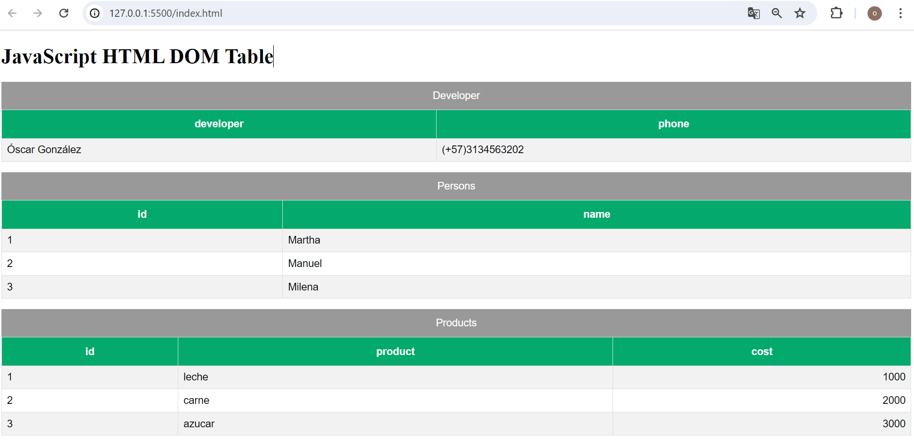
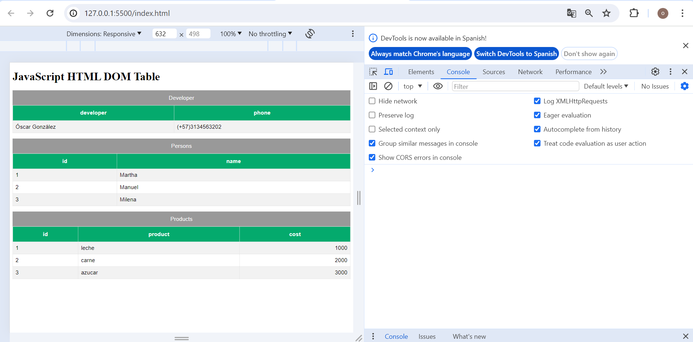

# javascript-html-dom-table.

Esta propuesta de trabajo es para proyectos 
de desarrollo web que requieran usar Javascript 
puro para mostrar datos en tablas usando DOM 
Javascript Puro.

## Sobre este repositorio.

Este repositorio es una bifurcación de un proyecto
que tenía alojado en mi primer cuenta de github
(mi cuenta como aprendiz):
https://github.com/OscarGonzalezADSI/javascript-html-dom-table

Si bien lo tenía publicado, no lo documenté porque estaba en proceso de aprendizaje, y como es normal, con mi falta de experiencia en ese entonces, cometí ese error.

Dos años después de haberlo creado, revisé su estructura, y encontre muchos detalles que no me gustaron:

<ol>
<li>No se habián definido los diferentes Script como módulos.</li>
<li>No se especificaba rutas entre los Script en la cabecera.</li>
<li>La revisión de la lógica de ejecución se hacia aburrida.</li>
<li>La ejecución de los Scripts se efectuaban en cascada desde HTML</li>
</ol>

Sin embargo, tambien encontré detalles que aún me siguen gustando y su valor no deja de estar vigente hoy en dia. Por lo tanto, consideré que es necesario hacer algo al respecto. Y este repositorio es su resultado.
## Vista de ejecución.

Se ha terminado de eliminar completamente 
errores reportados en consola.

## Descargue y pruebe en Visual Studio Code
Para su ejecución no es necesario preconfigurar 
ningún entorno de desarrollo, ni tampoco instalar 
ningún framework o librería, simplemente descargue y habra desde visual studio code.   

Una vez haya entrado al proyecto por medio de Visual Studio Code:
<ol>
<li>Click derecho en el EXPLORER  de Visual Studio Code al archivo index.html</li>
<li>Click Open with Live Server</li>
</ol>
